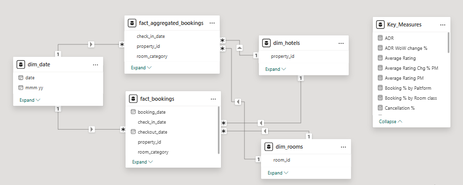
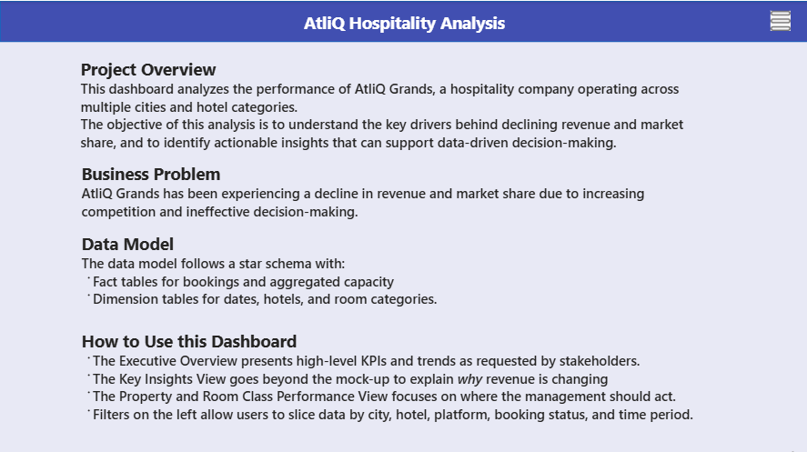
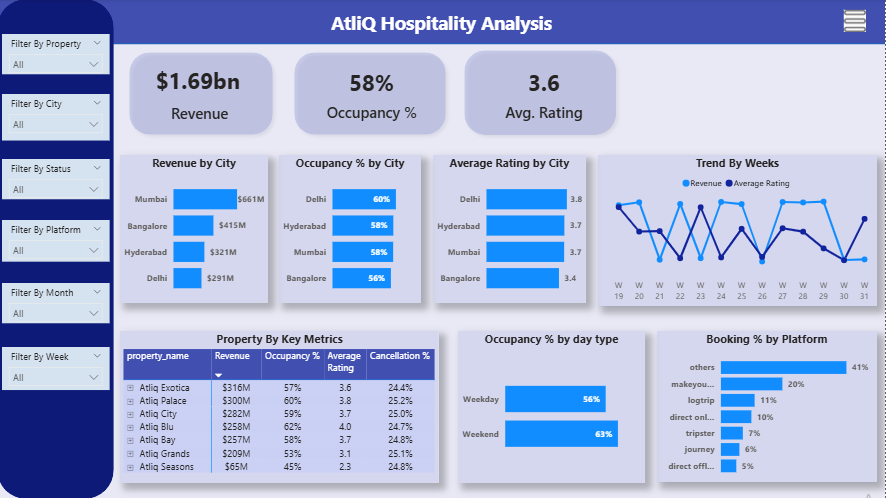
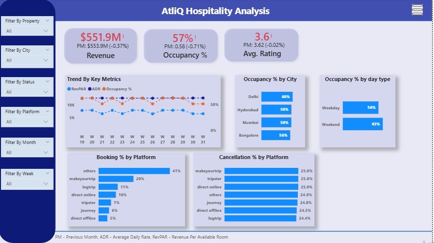
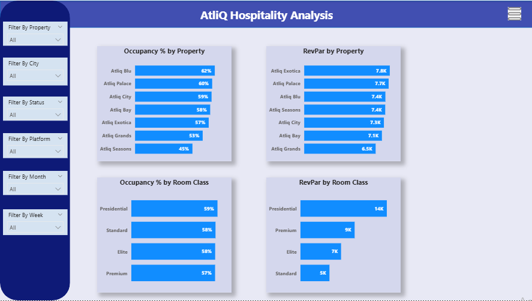

# AtliQ Hospitality Analysis - PowerBI

As part of the codebasics resume challenge, I have worked on this analysis project.

Link to [Interactive Dashboard]

## Problem statement

Atliq Grands owns multiple five-star hotels across India. They have been in the hospitality industry for the past 20 years. Due to strategic moves from other competitors and ineffective decision-making in management, Atliq Grands are losing its market share and revenue in the luxury/business hotels category. As a strategic move, the managing director of Atliq Grands wanted to incorporate “Business and Data Intelligence” in order to regain their market share and revenue. However, they do not have an in-house data analytics team to provide them with these insights.

Their revenue management team had decided to hire a 3rd party service provider to provide them insights from their historical data.

### Task List

- Create the metrics according to the metric list. 
- Create a dashboard according to the mock-up provided by stakeholders. 
- Create relevant insights that are not provided in the metric list/mock-up dashboard.

## Provided Mock-up Dashboard

    

## Data Model

    

## Info

    

## Executive Overview

    

## Key Insights View

    

## Property & Room Class Performance

    

## Key Insights from the Dashboard

- Analysis of Revenue, ADR, Occupancy, and RevPAR showed that ADR remained stable while occupancy fluctuated significantly, indicating revenue decline is driven by demand and not pricing.
  
- Weekend occupancy was consistently higher than weekday occupancy, indicating a heavy reliance on leisure (weekend) demand and underperformance in weekday business travel.

- High dependancy on thrid party platforms("Others" from our dataset) creates higher commission costs and less control over customer relationships.

- Cancellation rates were consistently high across all platforms, not limited to a specific channel. This leads to demand volatility and last-minute unsold inventory.

- Property-level analysis revealed that a few hotels (e.g., AtliQ Grands, AtliQ Seasons) underperformed significantly in occupancy and/or RevPAR.

- Occupancy levels were similar across room classes, indicating uniform demand. However, RevPAR differed greatly, with higher room classes generating much more revenue per available room.

## Key Learnings from this Project

- Importance of Separating “What”, “Why”, and “Where”
- Understanding Core Hospitality Metrics(ADR, Occupancy, RevPAR)
- Insights Are More Valuable Than Visuals
- Thinking Like a Business Stakeholder

